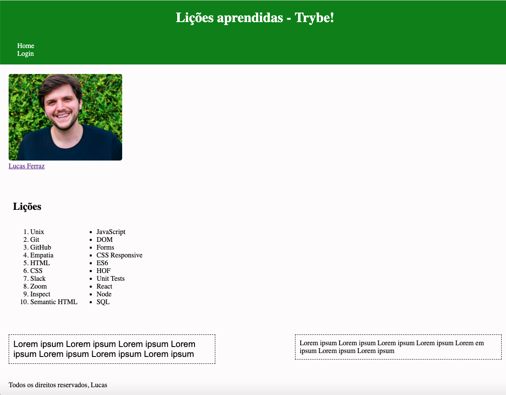

# Boas vindas ao Projeto WebChat!


## O que Desenvolvi:
Neste projeto desenvolvi um _chat_ online e ao utilizar essa aplicaçã você será capaz de:

 - Usar um front-end para enviar mensagens a clientes conectados;
 - Visualizar o histórico de mensagens da conversa;
 - Visualizar os usuários online no momento;
 - Alterar o nome de usuário no chat em tempo real;

O desenho abaixo demonstra como o projeto pode ser estruturado ao decorrer do desenvolvimento, use a sua criatividade para surpreender! 🧑‍🎨



## 🗒 Antes de começar a desenvolver

1. Clone o repositório

   - `git clone`.
   - Entre na pasta do repositório que você acabou de clonar


## Conexão com o banco:
As variáveis de ambiente receberão os seguintes valores

```
DB_URL=mongodb://localhost:27017/webchat/    // conexão local com o seu MongoDB
DB_NAME=webchat                             // nome do database
```

## Testes

Para executar os testes localmente, você pode rodar o comando `npm test`.

Caso prefira testar um requisito por vez pode executar o teste da seguinte forma: `npm test tests/req1` (nesse caso testa apenas o requisito 1)

---
